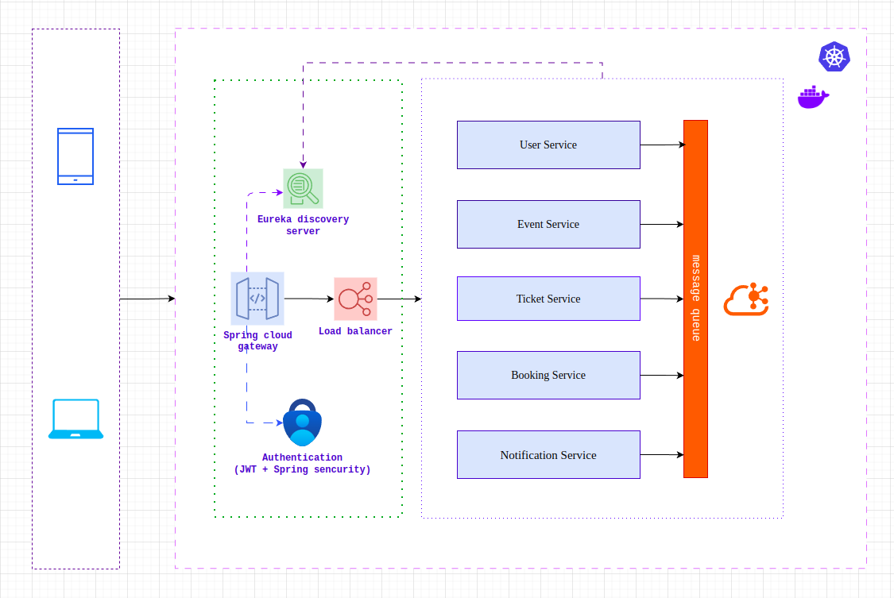
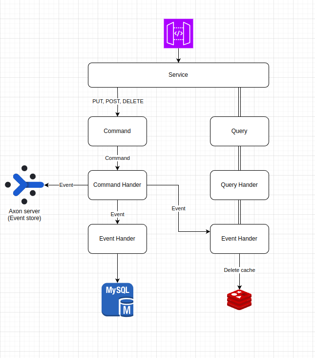
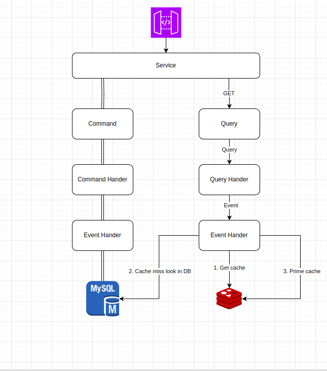
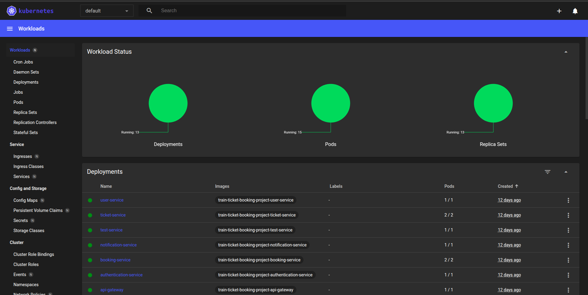
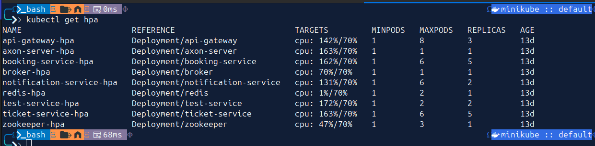
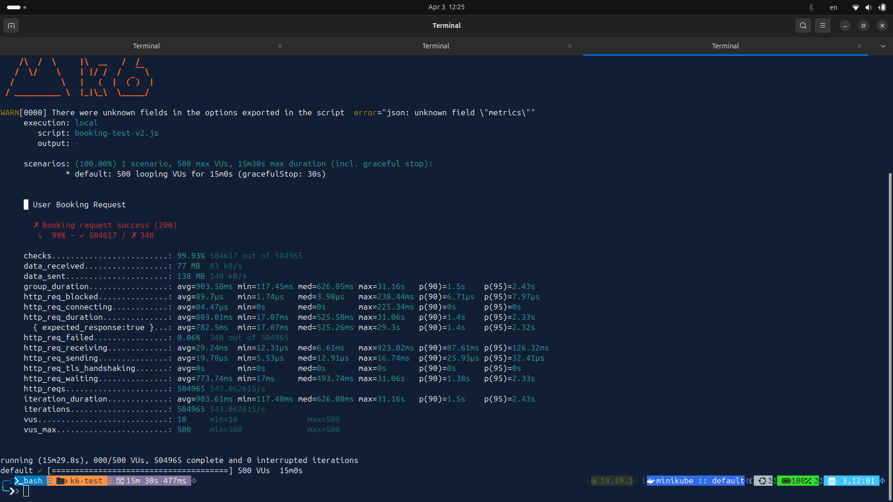

Dưới đây là bản dịch tiếng Anh của README của bạn, phù hợp để đặt trong `README.en.md` hoặc thay thế bản chính nếu bạn muốn dùng tiếng Anh làm ngôn ngữ mặc định:

---

# 🎟️ ONLINE EVENT TICKETING SYSTEM - MICROSERVICES ARCHITECTURE

## 📖 Table of Contents

1. [🦩 Overview](#-overview)
2. [👥 Target Users](#-target-users)
3. [✨ Main Features](#-main-features)
4. [🏗️ System Architecture](#-system-architecture)
5. [⚙️ Technologies Used](#-technologies-used)
6. [🧠 CQRS + Axon Framework](#-cqrs--axon-framework)
7. [🚀 Redis Cache Flow](#-redis-cache-flow)
8. [⚓️ Deployment on Kubernetes & HPA](#-deployment-on-kubernetes--hpa)
9. [🧪 Performance Testing with K6](#-performance-testing-with-k6)
10. [📌 Production Direction](#-production-direction)

---

## 🦩 Overview

The event ticketing system is a platform that enables users to **browse - select - book tickets** for online events without physically attending a venue.  
Built with a **Microservices** architecture, the system supports **flexible scaling**, **high load capacity**, and easy deployment on **Kubernetes**.

> 👉 Check out the real-world interface: [ticketbox.vn](https://ticketbox.vn/)

---

## 👥 Target Users

- **End-users**: Browse and book tickets quickly and conveniently.
- **Organizers / Admins**: Manage events, monitor revenue and orders.

---

## ✨ Main Features

### For end-users:

- Browse list of events.
- Receive notifications & manage tickets.

### For admins:

- CRUD events & ticket types.
- Manage revenue and orders.

---

## 🏗️ System Architecture

The system consists of multiple **microservices** communicating via **Kafka** or **Axon Server**.

### System Overview:



| Component             | Description                                  |
| ---------------------|----------------------------------------------|
| **API Gateway**       | Entry point, routing, authentication (JWT). |
| **Eureka Discovery**  | Service Registry.                            |
| **Kafka / Axon Server** | Messaging/Event Bus.                      |
| **Redis**             | Data caching.                                |
| **MySQL**             | Main database.                               |

---

## ⚙️ Technologies Used

| Component          | Technology                     |
|--------------------|--------------------------------|
| API Gateway         | Spring Cloud Gateway           |
| Service Discovery   | Eureka                         |
| Authentication      | Spring Security + JWT          |
| Messaging           | Kafka / Axon Server            |
| Database            | MySQL                          |
| Caching             | Redis                          |
| CI/CD               | GitHub Actions                 |
| Deployment          | Docker, Kubernetes             |
| Monitoring          | Prometheus + Grafana (planned) |
| Performance Testing | K6                             |

---

## 🧠 CQRS + Axon Framework

Services use **CQRS** + **Event Sourcing** with Axon Framework, clearly separating **Commands** and **Queries**.



---

## 🚀 Redis Cache Flow

Applied cache pattern:

- On GET: Fetch from Redis.
- If cache miss → query DB → write back to Redis.



---

## ⚓️ Deployment on Kubernetes & HPA

### 🪡 Deployment Process

- Each service is a `Deployment` in K8s.
- Exposed via `Service`, routed through `Ingress`.
- Dynamically configured with `ConfigMap`, `Secrets`.



```yaml
apiVersion: apps/v1
kind: Deployment
metadata:
  name: auth-service
spec:
  replicas: 1
  selector:
    matchLabels:
      app: auth
  template:
    metadata:
      labels:
        app: auth
    spec:
      containers:
        - name: auth
          image: your-repo/auth-service:latest
```

---

### 📊 HPA - Horizontal Pod Autoscaler

HPA automatically scales pods based on CPU or custom metrics.



```yaml
apiVersion: autoscaling/v2
kind: HorizontalPodAutoscaler
metadata:
  name: auth-service-hpa
spec:
  scaleTargetRef:
    apiVersion: apps/v1
    kind: Deployment
    name: auth-service
  minReplicas: 2
  maxReplicas: 10
  metrics:
    - type: Resource
      resource:
        name: cpu
        target:
          type: Utilization
          averageUtilization: 60
```

> 📈 When CPU > 60%, pods are scaled up. When load decreases, pods scale down automatically.

---

## 🧪 Performance Testing with K6

- Load testing using **K6**.
- Simulates user interactions with the API.
- Combined with **Prometheus** + **Grafana** for performance monitoring and autoscaling insights.



---

Nếu bạn muốn, mình có thể tạo thêm bản `README.vi.md` từ nội dung gốc để bạn tổ chức file README dạng đa ngôn ngữ luôn. Muốn mình làm giúp không?